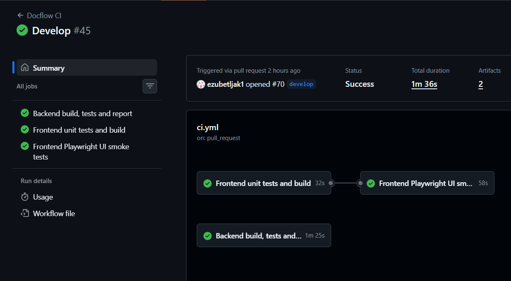
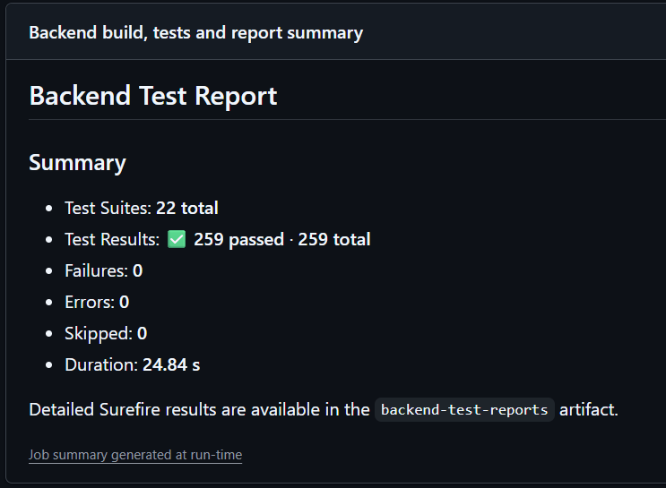
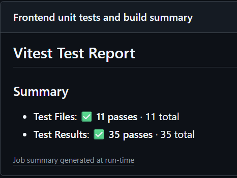
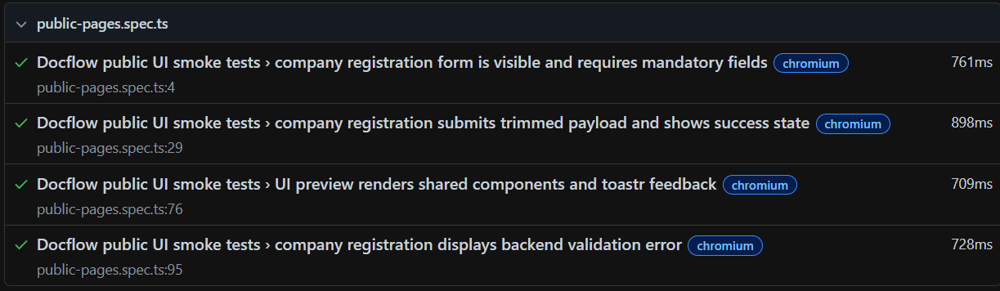
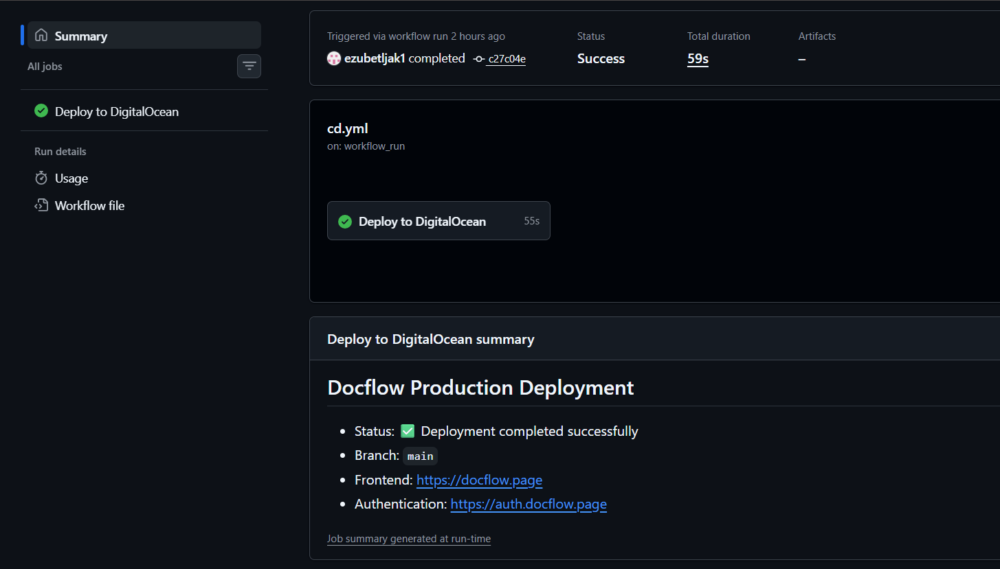

# Test Summary / QA izvještaj

## 1. Svrha dokumenta

Ovaj dokument predstavlja završni pregled testiranja sistema **Docflow**.

Cilj dokumenta je dati konkretan i provjeriv prikaz:

* vrsta testiranja koje su korištene;
* načina pokretanja automatizovanih testova;
* rezultata posljednjeg uspješnog CI izvršavanja;
* funkcionalnih dijelova sistema koji su automatizovano provjereni;
* dijelova sistema koji su provjereni ručno;
* ključnih korisničkih tokova koji su testirani;
* poznatih ograničenja testiranja;
* lokacija na kojima se mogu pronaći logovi, HTML izvještaji i drugi dokazi rezultata.

Detaljna evidencija pojedinačnih testnih scenarija kroz sprintove ostaje dostupna u dokumentu:

```text
TestBook.md
```

TestBook sadrži historijski pregled testiranja kroz sprintove i detaljne zapise sa koracima, očekivanim ishodima, stvarnim ishodima i statusima.

---

## 2. Sažetak rezultata

Prema posljednjem uspješnom CI izvršavanju tokom finalne provjere sistema, automatizovani testovi imaju sljedeće rezultate:

| Sloj testiranja                    | Broj testnih suite-ova ili fajlova | Broj testova | Rezultat                                            |
| ---------------------------------- | ---------------------------------: | -----------: | --------------------------------------------------- |
| Backend automatizovani testovi     |              `22` Surefire suite-a |        `259` | `259 passed`, `0 failures`, `0 errors`, `0 skipped` |
| Frontend unit i component testovi  |            `11` `.spec.ts` fajlova |         `35` | `35 passed`                                         |
| Playwright UI smoke testovi        |                `1` `.spec.ts` fajl |          `4` | `4 passed`                                          |
| **Ukupno automatizovanih testova** |                                  — |    **`298`** | **Svi testovi prolaze**                             |

Pored automatizovanih testova, kroz razvoj projekta evidentirano je i ručno API, frontend/UI, end-to-end, regresiono i deployment smoke testiranje.

Detaljni TestBook sadrži ukupno `530` dokumentovanih scenarija kroz Sprintove 5–10.

| Sprint     | Fokus testiranja                                               | Broj evidentiranih scenarija |
| ---------- | -------------------------------------------------------------- | ---------------------------: |
| Sprint 5   | Upload i upravljanje dokumentima                               |                         `42` |
| Sprint 6   | OCR i AI ekstrakcija                                           |                         `34` |
| Sprint 7   | Editovanje, validacija i potvrda ekstrakcije                   |                         `50` |
| Sprint 8   | Autentifikacija, role, multi-tenancy i document types          |                        `143` |
| Sprint 9   | Workflow, taskovi, komentari, status history i audit log       |                        `108` |
| Sprint 10  | Extraction field management, notifikacije, XML izlaz i filteri |                        `153` |
| **Ukupno** | —                                                              |                    **`530`** |

Napomena: dokumentovani TestBook scenariji nisu isto što i broj izvršivih automatizovanih test metoda. Pojedini poslovni tokovi evidentirani su zasebno kroz backend, UI, API, E2E i deployment smoke perspektivu kako bi se provjerili na različitim nivoima sistema.

---

## 3. Vrste testiranja

| Vrsta testiranja                | Način izvršavanja                                   | Namjena                                                                                                 |
| ------------------------------- | --------------------------------------------------- | ------------------------------------------------------------------------------------------------------- |
| Backend automatizovani testovi  | Maven i JUnit/Spring testovi                        | Provjera poslovne logike, validacija, sigurnosnih pravila, baze i integracije između backend komponenti |
| Frontend unit testovi           | Angular test runner i Vitest                        | Provjera funkcija, guardova, store servisa i komponenti uz mockovane zavisnosti                         |
| Frontend component testovi      | Angular `TestBed` i Vitest                          | Provjera renderovanja komponenti, prikaza akcija, filtera i stanja UI-a                                 |
| Playwright UI smoke testovi     | Playwright i Chromium                               | Automatizovana provjera ključnih javno dostupnih UI tokova u browseru                                   |
| Manualno API testiranje         | Swagger i Postman                                   | Provjera endpointa, HTTP odgovora i negativnih scenarija                                                |
| Manualno frontend/UI testiranje | Browser                                             | Provjera prikaza, formi, poruka, rola i ponašanja interfejsa                                            |
| End-to-end testiranje           | Browser, backend, baza i storage                    | Provjera kompletnog korisničkog toka kroz više slojeva sistema                                          |
| Regresiono testiranje           | Ponovno izvršavanje postojećih tokova nakon izmjena | Provjera da nove funkcionalnosti nisu pokvarile prethodno stabilne tokove                               |
| Deployment smoke testiranje     | Docker Compose, produkcijski server i javni URL-ovi | Provjera da se aplikacija pokreće i da su osnovni servisi dostupni nakon deploymenta                    |

---

# Dio I — Automatizovano testiranje

## 4. Pokretanje automatizovanih testova

### 4.1. Backend testovi

Na Linux ili macOS sistemu:

```bash
cd Project/backend
./mvnw clean verify
```

Na Windows sistemu:

```powershell
cd Project/backend
.\mvnw.cmd clean verify
```

Backend testovi generišu Surefire izvještaje u direktoriju:

```text
Project/backend/target/surefire-reports/
```

HTML izvještaj se generiše kroz Maven Surefire Report plugin.

### 4.2. Frontend unit i component testovi

```bash
cd Project/frontend
npm ci
npm run test:ci
```

### 4.3. Frontend production build

```bash
cd Project/frontend
npm run build
```

Frontend build nije test poslovne logike, ali predstavlja obavezni quality gate jer potvrđuje da se Angular aplikacija može uspješno kompajlirati za produkcijsko okruženje.

### 4.4. Playwright UI smoke testovi

Pri prvom lokalnom pokretanju potrebno je instalirati Chromium:

```bash
cd Project/frontend
npx playwright install chromium
```

Zatim pokrenuti testove:

```bash
npm run e2e
```

HTML Playwright izvještaj može se otvoriti komandom:

```bash
npm run e2e:report
```

### 4.5. GitHub Actions CI

Automatizovani testovi pokreću se i kroz GitHub Actions workflow:

```text
.github/workflows/ci.yml
```

CI workflow izvršava tri glavna joba:

| CI job                               | Sadržaj                                                                                         |
| ------------------------------------ | ----------------------------------------------------------------------------------------------- |
| `Backend build, tests and report`    | Backend build, `clean verify`, backend summary, Surefire HTML report i upload backend artifacta |
| `Frontend unit tests and build`      | Instalacija npm zavisnosti, frontend unit/component testovi i Angular production build          |
| `Frontend Playwright UI smoke tests` | Instalacija Chromium browsera, Playwright smoke testovi i upload Playwright artifacta           |

Workflow se automatski pokreće za odgovarajuće `pull_request` i `push` događaje.

Može se pokrenuti i ručno:

```text
GitHub repozitorij
→ Actions
→ Docflow CI
→ Run workflow
→ Odabrati željenu granu
→ Run workflow
```

Ručno pokretanje je korisno kada je potrebno ponoviti provjeru bez kreiranja novog commita ili pull requesta.

---

## 5. Backend automatizovano testiranje po dijelovima sistema

Backend testovi nalaze se u direktoriju:

```text
Project/backend/src/test/java/ba/unsa/si/docflow/
```

Testovi su organizovani po funkcionalnim cjelinama.

| Dio sistema                           | Primjeri testnih klasa ili paketa               | Ključne automatizovane provjere                                                                                                                          |
| ------------------------------------- | ----------------------------------------------- | -------------------------------------------------------------------------------------------------------------------------------------------------------- |
| Pokretanje aplikacije                 | `DocflowBackendApplicationTests.java`           | Učitavanje Spring Boot konteksta                                                                                                                         |
| Registracija kompanije i tenant model | `company/`                                      | Registracija kompanije, validacije, povezivanje prvog administratora i izolacija podataka kompanija                                                      |
| Upravljanje dokumentima               | `document/`                                     | Upload, validacije tipa i veličine fajla, download, preview, brisanje dokumenta i tenant izolacija                                                       |
| OCR, klasifikacija i ekstrakcija      | `extraction/`                                   | Routing prema processorima, `OTHER` classifier flow, classification review, placeholders, required polja, low-confidence pravila i type-aware validacija |
| Korisnici i role                      | `user/`, `role/`                                | Kreiranje korisnika, promjena statusa i role, ograničenja pristupa i tenant izolacija                                                                    |
| Sigurnost                             | `security/`, `keycloak/`                        | Autentifikacija, JWT zaštita, dozvole po rolama i Keycloak integracija                                                                                   |
| Workflow i taskovi                    | `workflow/`                                     | Assignment, start, complete, cancel, duplicate task zaštita, due date pravila i ograničenje poslovnih akcija na dodijeljenog korisnika                   |
| Approval flow                         | `workflow/`                                     | Approve, reject i return-for-correction tokovi, komentari i statusne promjene                                                                            |
| Status history i audit log            | `workflow/`                                     | Kreiranje historije statusa, audit zapisi i role-based pristup audit logu                                                                                |
| Notifikacije i email reminder         | `notification/NotificationIntegrationTest.java` | In-app notifikacije, unread count, mark-as-read ponašanje, digest slanje i sprečavanje duplog slanja                                                     |
| XML izlaz                             | `xml/XmlOutputIntegrationTest.java`             | Generate, preview, download, regenerate, escaping XML znakova, complete processing i delete cascade                                                      |

### 5.1. Najvažnije backend provjere

Automatizovani backend testovi posebno provjeravaju:

* odbijanje nevalidnih upload zahtjeva;
* izolaciju podataka između kompanija;
* blokiranje akcija za nedozvoljene role;
* direktni routing za `INVOICE`, `RECEIPT`, `BANK_STATEMENT` i `FORM`;
* auto-klasifikaciju dokumenta uploadovanog kao `OTHER`;
* status `NEEDS_CLASSIFICATION_REVIEW`;
* ručnu potvrdu tipa dokumenta;
* placeholder polja za nedostajuće required vrijednosti;
* validaciju datuma i numeričkih polja;
* amount consistency pravila;
* blokiranje confirma dok review nije završen;
* assignment i completion taskova;
* approve, reject i return-for-correction tokove;
* audit log i status history zapise;
* kreiranje i čitanje notifikacija;
* email reminder digest;
* generisanje i finalizaciju XML izlaza;
* brisanje povezanih zapisa bez orphan podataka i FK grešaka.

---

## 6. Frontend automatizovani testovi

Frontend unit i component testovi nalaze se u direktoriju:

```text
Project/frontend/src/app/
```

### 6.1. Pregled frontend test fajlova

| Test fajl                                                     | Broj testova | Šta se provjerava                                                                                                         |
| ------------------------------------------------------------- | -----------: | ------------------------------------------------------------------------------------------------------------------------- |
| `app.spec.ts`                                                 |          `2` | Kreiranje glavne aplikacije i pokretanje auth inicijalizacije                                                             |
| `auth/services/auth.guard.spec.ts`                            |          `3` | Pristup autentifikovanog korisnika, login redirect za neautentifikovanog korisnika i javni pristup registraciji kompanije |
| `auth/services/role.guard.spec.ts`                            |          `4` | Dozvoljene role, redirect za nedozvoljene role, dohvat profila i javna registracijska ruta                                |
| `notifications/services/notification-store.service.spec.ts`   |          `4` | Učitavanje notifikacija, unread count, označavanje jedne notifikacije kao pročitane i označavanje svih notifikacija       |
| `documents/models/extraction-field-options.spec.ts`           |          `7` | Canonical extraction field opcije, custom field slug, custom prefiks i prikaz labela                                      |
| `shared/utils/datetime.utils.spec.ts`                         |          `6` | API datetime parsiranje, evropski format datuma, validacija inputa i prikaz prazne vrijednosti                            |
| `documents/documents-page/documents-page.spec.ts`             |          `4` | Upload akcije po rolama, search/filter panel, kombinovanje filtera i reset filtera                                        |
| `tasks/pages/my-tasks-page/my-tasks-page.spec.ts`             |          `2` | Renderovanje otvorenog taska i start akcija                                                                               |
| `users/pages/users-page/users-page.spec.ts`                   |          `1` | Kreiranje korisnika i ponovno učitavanje liste                                                                            |
| `documents/document-detail-page/document-detail-page.spec.ts` |          `1` | Sakrivanje workflow sekcija za dokument u statusu `COMPLETED`                                                             |
| `dashboard/pages/dashboard-page/dashboard-page.spec.ts`       |          `1` | Kreiranje dashboard komponente                                                                                            |
| **Ukupno**                                                    |     **`35`** | —                                                                                                                         |

### 6.2. Novododane frontend provjere u finalnoj verziji

U finalnom sprintu frontend automatizovano testiranje je prošireno tako da obuhvata:

* auth guard i role guard ponašanje;
* store logiku za notifikacije;
* evropsko formatiranje vremena i datuma;
* extraction field opcije i custom labele;
* search i filter kombinacije na listi dokumenata;
* My Tasks prikaz i start akciju;
* sakrivanje workflow sekcija za završene dokumente;
* kreiranje korisnika kroz users komponentu;
* osnovnu provjeru glavne aplikacije i dashboard komponente.

---

## 7. Playwright UI smoke testovi

Playwright testovi nalaze se u fajlu:

```text
Project/frontend/e2e/public-pages.spec.ts
```

Trenutno se automatski izvršavaju četiri UI smoke testa u Chromium browseru.

| Test                                         | Provjera                                                                                                                     |
| -------------------------------------------- | ---------------------------------------------------------------------------------------------------------------------------- |
| Prikaz registracijske forme i required polja | Registracijska stranica je dostupna, submit dugme je inicijalno onemogućeno i aktivira se nakon popunjavanja obaveznih polja |
| Uspješna registracija kompanije              | Forma šalje trimovane vrijednosti prema API-ju i prikazuje success stanje                                                    |
| UI preview i toastr feedback                 | Zajedničke UI komponente se renderuju i success toastr poruka se prikazuje nakon akcije                                      |
| Prikaz backend validacione greške            | UI prikazuje razumljivu poruku kada backend vrati grešku za postojeći email kompanije                                        |

Playwright testovi koriste mockovane API odgovore za javne stranice kako bi bili deterministični i kako ne bi kreirali stvarne podatke pri svakom CI izvršavanju.

---

# Dio II — Ručno testiranje po dijelovima sistema

## 8. Ručno testirani dijelovi sistema

Pored automatizovanih provjera, sistem je testiran ručno kroz browser, Swagger/Postman, Docker okruženje i produkcijski server.

| Dio sistema                  | Ručno provjereni scenariji                                                                                      | Način provjere                       | Rezultat |
| ---------------------------- | --------------------------------------------------------------------------------------------------------------- | ------------------------------------ | -------- |
| Registracija kompanije       | Kreiranje kompanije i prvog administratora, validacija required polja i duplikatnog emaila                      | Browser i Swagger/Postman            | Pass     |
| Prijava i odjava korisnika   | Login kroz Keycloak, logout i redirekcija na zaštićenim rutama                                                  | Browser                              | Pass     |
| Role-based pristup           | Razlike između `ADMIN`, `MANAGER`, `OPERATOR` i `APPROVER` korisnika                                            | Browser i Swagger/Postman            | Pass     |
| Upravljanje korisnicima      | Kreiranje korisnika, dodjela role, promjena statusa i slanje linka za inicijalnu promjenu lozinke               | Browser                              | Pass     |
| Upload dokumenata            | PDF, PNG i JPG/JPEG fajlovi, nevalidan tip fajla, prevelik fajl i required polja                                | Browser i Swagger/Postman            | Pass     |
| Lista dokumenata             | Prikaz, empty state, search po nazivu i ID-u, filter po statusu, tipu, datumu i assignee korisniku              | Browser                              | Pass     |
| Detalji dokumenta            | Preview, download, prikaz metapodataka, sakrivanje internih detalja i prikaz statusa                            | Browser                              | Pass     |
| OCR ekstrakcija              | Pokretanje ekstrakcije, retry, refresh fields i prikaz OCR rezultata                                            | Browser i Swagger/Postman            | Pass     |
| Tipovi dokumenata            | `INVOICE`, `RECEIPT`, `BANK_STATEMENT`, `FORM` i `OTHER`                                                        | Browser i Swagger/Postman            | Pass     |
| Auto-klasifikacija           | `OTHER` dokument sa sigurnom klasifikacijom i `NEEDS_CLASSIFICATION_REVIEW` scenario                            | Browser i Swagger/Postman            | Pass     |
| Ručna potvrda tipa dokumenta | Izbor podržanog tipa nakon classification review-a                                                              | Browser                              | Pass     |
| Extraction field review      | Edit canonical polja, dodavanje custom polja, brisanje opcionog polja i čišćenje required polja                 | Browser i Swagger/Postman            | Pass     |
| Validacija ekstrakcije       | Datumi, numeričke vrijednosti, prazna required polja, placeholder polja i low-confidence review                 | Browser i Swagger/Postman            | Pass     |
| Task assignment              | Dodjela `EXTRACTION`, `CORRECTION` i `APPROVAL` taskova, start, completion i cancel                             | Browser                              | Pass     |
| My Tasks                     | Prikaz otvorenih taskova, overdue oznake i otvaranje povezanog dokumenta                                        | Browser                              | Pass     |
| Approval flow                | Approve, reject i return-for-correction sa obaveznim komentarom                                                 | Browser i Swagger/Postman            | Pass     |
| Correction flow              | Vraćanje dokumenta na korekciju, editovanje polja i reconfirm extraction                                        | Browser                              | Pass     |
| Komentari                    | Dodavanje i prikaz komentara na dokumentu                                                                       | Browser                              | Pass     |
| Status history               | Prikaz hronoloških promjena statusa dokumenta                                                                   | Browser                              | Pass     |
| Audit log                    | Prikaz audit zapisa za Admin/Manager korisnike i blokiranje pristupa drugim rolama                              | Browser i Swagger/Postman            | Pass     |
| In-app notifikacije          | Notification badge, unread count, označavanje jedne i svih poruka kao pročitanih, navigacija preko action URL-a | Browser                              | Pass     |
| Email reminder               | Slanje digest emaila za nepročitane notifikacije i provjera da se ista notifikacija ne šalje ponovo             | Browser, email inbox i backend log   | Pass     |
| XML izlaz                    | Generate, preview, download, regenerate i complete processing                                                   | Browser i Swagger/Postman            | Pass     |
| Brisanje dokumenta           | Brisanje dokumenta sa povezanim extraction, workflow, notification i XML zapisima bez orphan podataka           | Browser i backend log                | Pass     |
| Responsivnost UI-a           | Pregled ključnih ekrana na manjim širinama browsera                                                             | Browser responsive preview           | Pass     |
| Produkcijski deployment      | Pokretanje CD workflowa, dostupnost javnih URL-ova i ručni smoke prolaz                                         | GitHub Actions, browser i server log | Pass     |

---

## 9. Manualno API testiranje

Manualno API testiranje izvršavano je kroz Swagger i Postman.

Provjereni su endpointi i scenariji za:

| Funkcionalna cjelina       | Primjeri provjera                                                      |
| -------------------------- | ---------------------------------------------------------------------- |
| Registracija kompanije     | Validan zahtjev, required polja i duplikatni email                     |
| Korisnici i role           | Kreiranje korisnika, promjena role i statusa                           |
| Dokumenti                  | Upload, lista, detalji, preview, download i delete                     |
| Extraction                 | Run, retry, refresh, edit, add field, delete field i confirm           |
| Classification             | Auto-classification i ručni izbor tipa dokumenta                       |
| Workflow taskovi           | Assign, start, complete i cancel                                       |
| Approval                   | Approve, reject i return for correction                                |
| Komentari i status history | Dodavanje komentara i dohvat historije                                 |
| Audit log                  | Dohvat sa odgovarajućom rolom i forbidden odgovor za nedozvoljenu rolu |
| Notifikacije               | Lista, unread count, mark one read i mark all read                     |
| XML izlaz                  | Generate, preview, download, regenerate i complete processing          |

---

## 10. Ključni end-to-end korisnički tokovi

| ID       | Korisnički tok                    | Koraci                                                                                                                             | Očekivani završni rezultat                                            | Status |
| -------- | --------------------------------- | ---------------------------------------------------------------------------------------------------------------------------------- | --------------------------------------------------------------------- | ------ |
| `E2E-01` | Registracija i inicijalni pristup | Registrovati kompaniju → otvoriti email link → postaviti lozinku → prijaviti se                                                    | Administrator dobija pristup svom workspace-u                         | Pass   |
| `E2E-02` | Kreiranje korisnika               | Prijaviti se kao Admin → kreirati korisnika → dodijeliti rolu → korisnik postavlja lozinku                                         | Novi korisnik može pristupiti sistemu u okviru svoje kompanije        | Pass   |
| `E2E-03` | Standardni invoice flow           | Uploadati invoice → pokrenuti extraction → pregledati polja → popuniti placeholder vrijednosti → potvrditi extraction              | Dokument prelazi u `READY_FOR_APPROVAL`                               | Pass   |
| `E2E-04` | Auto-classification flow          | Uploadati dokument kao `OTHER` → classifier odredi podržan tip → pokrenuti odgovarajući parser                                     | Dokument dobija konačni tip i extraction rezultat                     | Pass   |
| `E2E-05` | Classification review flow        | Uploadati dokument kao `OTHER` → classifier vrati nizak confidence ili `OTHER` → ručno potvrditi tip → ponovo pokrenuti extraction | Dokument se obrađuje nakon ručne potvrde tipa                         | Pass   |
| `E2E-06` | Correction flow                   | Confirmati extraction → vratiti dokument na korekciju → izmijeniti polja → reconfirm extraction                                    | Dokument se ponovo vraća u `READY_FOR_APPROVAL`                       | Pass   |
| `E2E-07` | Task assignment flow              | Dodijeliti task → otvoriti My Tasks → startati task → završiti potrebnu akciju na dokumentu                                        | Task se pravilno kompletira                                           | Pass   |
| `E2E-08` | Approval flow                     | Confirmati extraction → dodijeliti approval task → odobriti, odbiti ili vratiti dokument na korekciju                              | Status dokumenta odgovara izabranoj approval akciji                   | Pass   |
| `E2E-09` | Notification flow                 | Izvršiti workflow akciju → otvoriti notification center → označiti notifikaciju pročitanom → otvoriti action URL                   | Notifikacija postaje pročitana i korisnik dolazi na povezanu stranicu | Pass   |
| `E2E-10` | XML finalizacija                  | Odobriti dokument → generisati XML → pregledati preview → preuzeti XML → završiti obradu                                           | Dokument prelazi u `COMPLETED`, a XML ostaje dostupan                 | Pass   |
| `E2E-11` | Search i filter flow              | Kreirati dokumente različitih tipova i statusa → primijeniti search i filtere                                                      | Lista prikazuje samo relevantne dokumente                             | Pass   |
| `E2E-12` | Tenant isolation                  | Pokušati dohvatiti podatke druge kompanije                                                                                         | Pristup podacima druge kompanije je blokiran                          | Pass   |
| `E2E-13` | Produkcijski smoke flow           | Pokrenuti CD → otvoriti javnu aplikaciju → login → Documents → Profile → My Tasks → notifications → logout                         | Produkcijska aplikacija je dostupna i osnovni tokovi rade             | Pass   |

---

# Dio III — CI, deployment i dokazi rezultata

## 11. CI quality gate

GitHub Actions CI workflow predstavlja obavezni quality gate prije produkcijskog deploymenta.

Automatizovani deployment se pokreće tek nakon uspješnog CI izvršavanja za `push` događaj na grani:

```text
main
```

CI provjerava:

1. backend build;
2. backend testove;
3. frontend unit i component testove;
4. frontend production build;
5. Playwright UI smoke testove.

Ako bilo koji obavezni job ne prođe, deployment se ne pokreće automatski.

---

## 12. Deployment smoke testiranje

Produkcijski deployment dodatno provjerava dostupnost servisa.

Serverska deployment skripta provjerava:

```text
http://127.0.0.1:8082/
http://127.0.0.1:8081/realms/docflow/.well-known/openid-configuration
```

GitHub Actions CD workflow zatim provjerava javne URL-ove:

```text
https://docflow.page/
https://auth.docflow.page/realms/docflow/.well-known/openid-configuration
```

Pored automatskih provjera, nakon deploymenta izvršava se ručna smoke provjera:

1. otvaranje frontend aplikacije;
2. otvaranje Keycloak login stranice;
3. login postojećeg korisnika;
4. otvaranje Documents stranice;
5. otvaranje Profile stranice;
6. otvaranje My Tasks stranice;
7. provjera notification centra;
8. logout korisnika.

---

## 13. Dokazi rezultata testiranja

### 13.1. GitHub Actions CI workflow

Dokaz izvršavanja automatizovanih testova nalazi se u GitHub Actions interfejsu:

```text
GitHub repozitorij
→ Actions
→ Docflow CI
→ Odabrati posljednji uspješan workflow run
```

Na sljedećem screenshotu prikazan je uspješno izvršen CI workflow. Vidljivo je da su sva tri obavezna joba završena bez greške:

- `Backend build, tests and report`
- `Frontend unit tests and build`
- `Frontend Playwright UI smoke tests`



*Slika 1. Uspješno izvršen Docflow CI workflow sa backend, frontend i Playwright jobovima.*

---

### 13.2. Backend test summary i HTML report

Backend job generiše sažetak rezultata automatizovanih backend testova.

Prema posljednjem uspješnom CI izvršavanju:

| Metrika | Rezultat |
|---|---:|
| Test suite-ovi | `22` |
| Ukupan broj testova | `259` |
| Prolazni testovi | `259` |
| Neuspješni testovi | `0` |
| Greške | `0` |
| Preskočeni testovi | `0` |



*Slika 2. Backend Test Report generisan kroz GitHub Actions workflow.*

Detaljni Surefire izvještaj dostupan je kao GitHub Actions artifact:

```text
backend-test-reports
```

Artifact sadrži:

```text
Project/backend/target/surefire-reports/
Project/backend/target/reports/
```

---

### 13.3. Frontend unit i component testovi

Frontend job generiše Vitest sažetak rezultata.

Prema posljednjem uspješnom CI izvršavanju:

| Metrika | Rezultat |
|---|---:|
| Test fajlovi | `11 / 11 passed` |
| Ukupan broj testova | `35 / 35 passed` |



*Slika 3. Vitest rezultat frontend unit i component testova.*

---

### 13.4. Playwright UI smoke testovi

Playwright HTML report prikazuje rezultate automatizovanih UI smoke testova izvršenih u Chromium browseru.

Provjereni su sljedeći scenariji:

1. prikaz registracijske forme i obaveznih polja;
2. slanje trimovanih vrijednosti i prikaz uspješnog stanja;
3. renderovanje zajedničkih UI komponenti i toastr poruke;
4. prikaz razumljive backend validacione greške.



*Slika 4. Playwright HTML report sa četiri uspješno izvršena UI smoke testa.*

Playwright report dostupan je i kao GitHub Actions artifact:

```text
playwright-report
```

Artifact sadrži:

```text
Project/frontend/playwright-report/
Project/frontend/test-results/
```

Lokalno se report može otvoriti komandom:

```bash
cd Project/frontend
npm run e2e:report
```

---

### 13.5. Produkcijski deployment dokaz

Dokaz ponovljivog deploymenta nalazi se u GitHub Actions interfejsu:

```text
GitHub repozitorij
→ Actions
→ Docflow CD
→ Odabrati posljednji uspješan workflow run
```

CD workflow potvrđuje da je sistem uspješno deployan na produkcijski DigitalOcean server i da su osnovne provjere dostupnosti završene bez greške.



*Slika 5. Uspješno izvršen produkcijski deployment kroz Docflow CD workflow.*

---

# Dio IV — Poznati testni propusti i ograničenja

## 14. Poznati testni propusti

| Ograničenje                                                                                           | Posljedica                                                                                        | Razlog                                                                                             | Moguće buduće unapređenje                                                              |
| ----------------------------------------------------------------------------------------------------- | ------------------------------------------------------------------------------------------------- | -------------------------------------------------------------------------------------------------- | -------------------------------------------------------------------------------------- |
| Playwright automatizacija trenutno pokriva javne stranice i UI smoke scenarije                        | Autentifikovani workflowi nisu kompletno automatizovani u browseru                                | Keycloak login i inicijalno postavljanje lozinke zahtijevaju dodatnu stabilnu testnu konfiguraciju | Dodati dedicated E2E realm, stabilne testne korisnike i Playwright storage state setup |
| Playwright testovi se izvršavaju samo u Chromium browseru                                             | Nema automatizovane cross-browser provjere                                                        | Fokus finalnog sprinta bio je na stabilnom smoke skupu                                             | Dodati Firefox i WebKit projekte                                                       |
| Google Document AI testovi u CI okruženju koriste mockovan OCR provider                               | CI ne potvrđuje dostupnost stvarnog Google servisa pri svakom izvršavanju                         | Izbjegavanje trošenja kredita i nestabilnosti vanjskog servisa                                     | Dodati periodični integration smoke test u kontrolisanom okruženju                     |
| SMTP scheduler logika je automatizovano provjerena, ali stvarna email dostava nije dio svakog CI runa | CI ne može potvrditi inbox delivery vanjskog SMTP servisa                                         | Kredencijali se ne koriste u CI okruženju                                                          | Dodati poseban staging SMTP smoke test                                                 |
| Nisu uvedeni automatizovani performance i load testovi                                                | Nije formalno izmjereno ponašanje pri velikom broju korisnika i dokumenata                        | Nije bilo dio definisanog opsega projekta                                                          | Dodati k6, JMeter ili sličan alat                                                      |
| Nisu izvršeni formalni penetration testovi                                                            | Sigurnosne provjere se zasnivaju na implementiranim pravilima pristupa i funkcionalnom testiranju | Nije bilo dio definisanog opsega projekta                                                          | Dodati OWASP ZAP i dodatni security review                                             |
| Nije uveden minimalni code coverage threshold                                                         | CI potvrđuje prolaz testova, ali ne blokira merge na osnovu procenta pokrivenosti                 | Fokus je bio na ključnim poslovnim pravilima i regresionim scenarijima                             | Dodati JaCoCo i frontend coverage pragove                                              |
| Vizuelna regresija UI-a nije automatizovana                                                           | Manje vizuelne promjene zahtijevaju ručni pregled                                                 | Nije uveden screenshot diff alat                                                                   | Dodati Playwright visual comparison testove                                            |
| Mobilni uređaji nisu pokriveni automatizovanim E2E testovima                                          | Responsivnost se provjerava ručno                                                                 | Fokus UI smoke testova je desktop browser                                                          | Dodati Playwright viewport projekte za mobilne uređaje                                 |

---

## 15. Procjena kvaliteta finalne verzije

Finalna verzija sistema ima višeslojno testiranje:

* backend poslovna pravila provjerena su automatizovanim testovima;
* frontend funkcije, guardovi, store servisi i ključne komponente pokriveni su unit i component testovima;
* javni UI smoke scenariji pokriveni su Playwright testovima;
* kompletni autentifikovani poslovni tokovi provjereni su ručno;
* vanjske integracije provjerene su kroz mockovane automatizovane testove i ručne smoke provjere;
* deployment je provjeren kroz CI/CD pipeline, lokalne health provjere i javne URL provjere.

Sistem nije predstavljen kao potpuno pokriven svim mogućim vrstama testiranja. Poznata ograničenja su evidentirana kako bi se jasno razlikovalo ono što je automatizovano provjereno od onoga što je testirano ručno ili ostavljeno za buduće unapređenje.

---

## 16. Završna kontrolna lista

### Automatizovani testovi

* [ ] Backend testovi prolaze: `259 / 259`.
* [ ] Frontend testovi prolaze: `35 / 35`.
* [ ] Playwright testovi prolaze: `4 / 4`.
* [ ] Frontend production build prolazi.
* [ ] GitHub Actions CI workflow je zelen.

### Ručno testiranje

* [ ] Registracija kompanije je provjerena.
* [ ] Login i logout su provjereni.
* [ ] Role-based pristup je provjeren.
* [ ] Upravljanje korisnicima je provjereno.
* [ ] Upload, preview i download dokumenta su provjereni.
* [ ] OCR i classification flow su provjereni.
* [ ] Extraction review, add field, delete field i confirm su provjereni.
* [ ] Task assignment i My Tasks su provjereni.
* [ ] Approval i correction flow su provjereni.
* [ ] Komentari, status history i audit log su provjereni.
* [ ] In-app i email notifikacije su provjerene.
* [ ] XML generate, preview, download i complete processing su provjereni.
* [ ] Search i filter panel su provjereni.
* [ ] Produkcijski deployment smoke flow je provjeren.

### Dokazi rezultata

* [ ] Dodat je screenshot zelenog `Docflow CI` workflow runa.
* [ ] Dodat je screenshot backend test summaryja.
* [ ] Dodat je screenshot frontend Vitest summaryja.
* [ ] Dodat je screenshot Playwright HTML reporta.
* [ ] Dodat je screenshot ili link uspješnog `Docflow CD` workflow runa.

---

## 17. Zaključak

Finalna verzija sistema **Docflow** provjerena je kombinacijom automatizovanih i ručnih testova.

Prema posljednjem uspješnom CI izvršavanju:

* prolazi `259` backend testova;
* prolazi `35` frontend unit i component testova;
* prolaze `4` Playwright UI smoke testa;
* Angular production build završava uspješno;
* CI workflow završava uspješno;
* CD pipeline omogućava ponovljiv deployment na produkcijski DigitalOcean server.

Ručno su provjereni ključni poslovni tokovi: registracija, autentifikacija, upravljanje korisnicima, upload i obrada dokumenata, OCR i klasifikacija, extraction review, task assignment, approval i correction flow, notifikacije, XML finalizacija, filterisanje dokumenata i produkcijski deployment.

Poznata ograničenja testiranja jasno su navedena i ne predstavljaju skrivene nedovršene funkcionalnosti.
