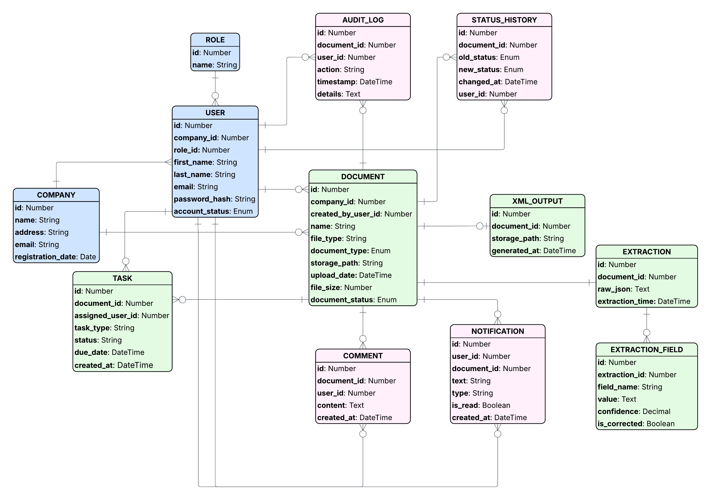

# Domain Model

## Uvod

U nastavku je prikazan domenski model sistema za obradu poslovnih dokumenata uz podršku OCR/AI obrade, validacije, odobravanja i generisanja XML izlaza.  
Model obuhvata glavne entitete sistema, njihove uloge u okviru sistema i poslovna pravila važna za njegovo funkcionisanje.

## ERD prikaz

U nastavku je dat entity-relationship dijagram koji vizuelno prikazuje entitete, njihove ključne atribute i veze između njih.

---

## Glavni entiteti

| Naziv | Svrha |
|---|---|
| Company | Predstavlja firmu registrovanu u sistemu. |
| User | Predstavlja korisnika sistema koji pripada određenoj firmi i ima definisanu ulogu. |
| Role | Predstavlja ulogu korisnika u sistemu. |
| Document | Predstavlja dokument uploadovan u sistem koji prolazi kroz proces obrade, validacije i odobravanja. |
| Extraction | Predstavlja rezultat OCR/AI obrade dokumenta. |
| ExtractionField | Predstavlja pojedinačno izdvojeno polje iz rezultata ekstrakcije. |
| StatusHistory | Predstavlja historiju promjena statusa dokumenta. |
| Comment | Predstavlja komentar dodan na dokument radi komunikacije, pojašnjenja ili povratne informacije. |
| XmlOutput | Predstavlja generisani XML izlaz vezan za dokument. |
| AuditLog | Predstavlja evidenciju ključnih akcija izvršenih nad dokumentima u sistemu. |
| Notification | Predstavlja obavještenje koje sistem šalje korisniku u vezi sa dokumentom ili zadatkom. |
| Task | Predstavlja zadatak dodijeljen konkretnom korisniku u vezi sa obradom, validacijom ili odobravanjem dokumenta. |

Ključni atributi i veze između entiteta prikazani su na datom entity-relationship dijagramu.

---

## Enum vrijednosti

| Entitet | Atribut | Vrijednosti |
|---|---|---|
| User | account_status | ACTIVE, INACTIVE |
| Document | document_type | INVOICE, OTHER, UNKNOWN |
| Document | document_status | UPLOADED, PROCESSING_FAILED, EXTRACTED, UNDER_REVIEW, READY_FOR_APPROVAL, APPROVED, REJECTED, COMPLETED |
| StatusHistory | old_status, new_status | Vrijednosti odgovaraju enumeraciji document_status. |

---

## Poslovna pravila važna za model

### 1. Pravila vezana za organizaciju i pristup
- Svaki korisnik mora pripadati tačno jednoj firmi.
- Korisnik može pristupati isključivo podacima firme kojoj pripada.
- Korisnik može imati samo jednu aktivnu ulogu u okviru sistema.
- Firma mora imati barem jednog administratorskog korisnika.

### 2. Pravila vezana za dokumente i obradu
- Svaki dokument mora biti vezan za tačno jednu firmu i korisnika koji ga je kreirao.
- OCR/AI obrada pokreće se tek nakon uspješnog uploada dokumenta.
- Ako OCR/AI obrada ne izdvoji potrebne podatke ili je pouzdanost izdvojenih podataka ispod definisanog praga, dokument ide na ručnu provjeru.
- Za jedan dokument može postojati najviše jedna ekstrakcija u okviru osnovne verzije sistema.
- Svaki izdvojeni podatak mora pripadati tačno jednoj ekstrakciji.

### 3. Pravila vezana za validaciju i odobravanje
- Dokument ne može ići na odobravanje ako obavezna polja nisu validna.
- Samo korisnik sa odgovarajućom ulogom može odobriti ili odbiti dokument.
- Odbijeni dokument mora imati evidentiran razlog ili komentar odbijanja.
- XML se može generisati samo za validiran i odobren dokument.

### 4. Pravila vezana za praćenje procesa
- Svaka promjena statusa dokumenta mora biti evidentirana u historiji statusa.
- Ključne korisničke akcije moraju biti evidentirane u audit logu.
- Svaki zadatak mora biti vezan za tačno jedan dokument i tačno jednog dodijeljenog korisnika.